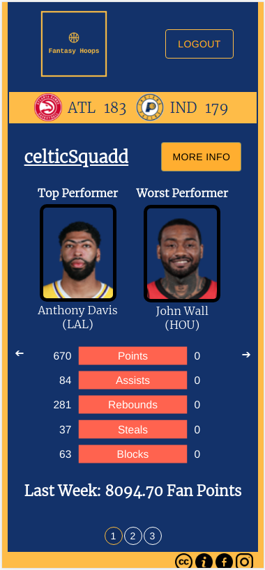

# Fantasy-Basketball-Helper-App
A helper app that allows users to at-a-glance see rich basketball data/statistics for their fantasy team so that they can make more informed and competitive decisions. This app is designed to be a complementary tool for the fantasy basketball experience.

# Instructions

run npm install in frontend and backend.  
run 'createdb fantasy_basket -O labber' the first time.  
create a .env based on the .env.exemple on both forntend and backend.  
run 'npm run db:reset'.  
run 'npm start' in the frontend and 'npm run dev' in the backend.  

# Screenshots
Landing Page: 
Home Page: 